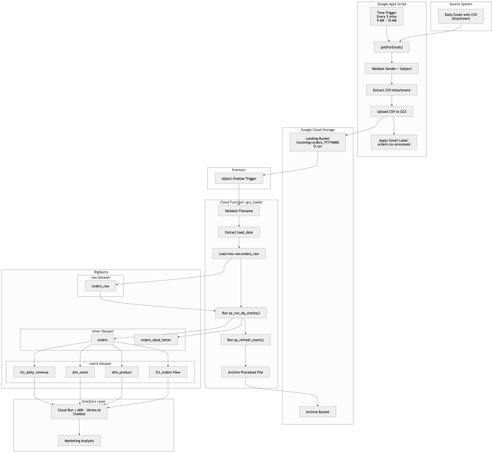

# Architecture

## System diagram

## Why these choices

- **Apps Script for email→GCS**: runs _inside_ the inbox owner's Google account. No OAuth client JSON, no refresh token, no Secret Manager, no Cloud Scheduler, no service account for Gmail access. ~80 lines.
- **No Dataflow / Composer**: 5K rows/day fits in one BQ load. Workers cost more than the entire pipeline's value at this scale.
- **GCS finalize event over scheduled poll**: free, instant, native — the file landing IS the trigger.
- **Pure BQ SQL for DQ**: per requirement. Every check is a `SELECT` predicate. Idempotent partition-scoped operations.
- **Marts refreshed in same loader call**: marts cannot change between loads; refreshing on any other cadence would be 23/24 wasted runs.
- **ADK agent over LangChain**: Google's first-party agent SDK has a native BigQuery toolset with `WriteMode.BLOCKED` enforced. No SQL injection surface. Dataset scoped to `marts` only.
- **Layered tables**: standard medallion. Raw is replay-safe. Silver is source of truth. Marts are the chatbot's read surface.
- **Partition + cluster**: `silver.orders` partitioned on `order_date`, clustered on `store_name`. Common chatbot questions hit one partition each.
